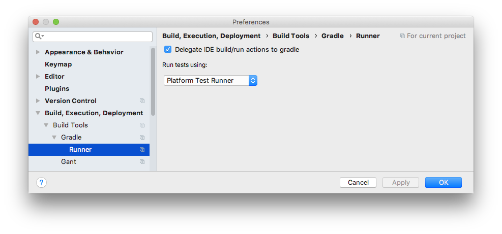

# Dependency injection with Dagger 2 - Part1: @Inject and @Provides

Dependency Injection, or DI in short, is a design pattern that allows to delegate the creation of objects and their dependencies to another object or framework. It is gaining a lot of interest in Android application development. This post shows how to inject objects using Dagger 2 through a console app.

## Introduction

Dagger 2 is a dependency injection framework developed by Google. It is not to be confused with the Dagger 1 Framework which is the previous version developed by Square. _Please note that the in the following paragraphs, I will also qualify Dagger 2 by Dagger (without numbers)_

Dagger 2 allows to define and configure dependencies using annotations. It also allows to inject into Android components such as Activities and Fragments thanks to Android-Dagger. In fact, Dagger 2 can be divided into two parts:

- Dagger: which provides the base dependency injection capabilities
- Dagger-Android: which allows to inject objects into Android components such as Activities and Fragments

This article studies Dagger DI annotations through a console application. We can also apply the following principles in an Android app, but for the sake of understanding and simplicity, I chose the simple console app.

The sample projects of this guide are created using IntteliJ and coded with the Kotlin language. To get Dagger to work in IntelliJ, add the following dependencies in the `build.gradle` of the console project;:

```groovy
def dagger_version = '2.17'
compile "com.google.dagger:dagger:$dagger_version"
kapt "com.google.dagger:dagger-compiler:$dagger_version"
```

After that, configure IntelliJ to delegate build acions to Gradle in settings -> Build, execution, depolyment -> Build Tools -> Gradle -> Runner



Now we are, ready to inject some dependencies.

## Dagger DI through a simple app

In this part, we will develop a console app that illustrates how to apply DI with dagger.

First, I will describe the problem that we are going to solve which is the same problem addressed in the official website. Suppose that we want to model a coffee maker that requires a thermosiphon pump and an electric heater to operate.

The solution of this problem is pretty straightforward. We need three classes: `ElectricHeader`, `Thermosiphon` and `CoffeeMaker`. The latter requires a instance of an `ElectricHeader` and `Thermosiphon` so that it can turn them on or off when the `CoffeeMaker` is turned on or off. In addition to that, the `Thermosiphon` needs the same `ElectricHeader` instance passed to the coffee maker.

Without dependency injection, we create the instances manually and the code should be similar to the one below:

```kotlin
val heater = ElectricHeater()
val pump = Thermosiphon(heater)
val coffeMaker = CoffeeMaker(heater, pump)
coffeeMaker.brew()
```

With dependency injection, the object instantiation is delegated to another class or framework. Thus, the previous code would look like this:

```kotlin
val coffeMaker = DIClassOrFramework.getCoffeeMaker()
coffeeMaker.brew()
```

It may seem like magic but (unfortunately) it is not. This kind of code is achieved by Dagger 2 thanks to some annotations and some lines of additional code. The good news is that the code and annotations we makes the business code smaller, and easier to test. Next, we will see how to actually make a coffee maker with Dagger 2.

Dagger 2 works by building a dependency graph. We call it a dependency graph because when we imagine objects and their dependencies, it is similar to a graph. In our case, the graph looks like this:

```
            +---->ElectricHeater
CoffeeMaker |          ^
            |          |
            |          |
            |          +
            +---> Thermosiphon
```

The graph has a root item which is the CoffeeMaker that has two dependencies illustrated by the arrows. Dagger 2 manages the dependency graph of the classes that have the `@Inject` and `@Provides` annotation. Dagger cannot instantiate or inject classes that do not have neither `@Inject` nor `@Provides` annotations.

In order to get an instance of the root object (CoffeeMaker), we need to create an interface that has a function that returns any class of the graph that we want. This interface must have the `@Componenet` annotation.

Here is a summary of our first Dagger annotations:

- `@Inject` and `@Provides`: class that have this annotations are integrated in the dependency graph of Dagger.
- `@Component`: used to annotate the interface that returns the root object of the graph.

The next section proposes a solution using some of these annotations.

## The @Inject annotation

We have many annotation to choose from to solve the problem. The `@Provides` annotation offers more possibilities than `@Inject` but requires more code. Thus, in the following section, we specify the dependency graph only with `@Inject` annotation.

```kotlin
@Singleton class ElectricHeater @Inject constructor() {
    var heating: Boolean = false
    val isHot get() = heating
    fun on() {
        this.heating = true
    }
    fun off() {
        this.heating = false
    }
}
class Thermosiphon @Inject constructor( private val heater: ElectricHeater ) {
    fun pump() {
        if (heater.isHot) {
            println("Heater is hot !!!")
        }
    }
}
class CoffeeMaker @Inject constructor() {
    @Inject lateinit var heater: ElectricHeater
    @Inject lateinit var pump: Thermosiphon
    fun brew() {
        println("Brewing coffee")
        heater.on()
        pump.pump()
        println("Coffee ready :)")
        heater.off()
    }
}
```

Here is the explanation of the most important parts of the code:

```kotlin
@Singleton class ElectricHeater @Inject constructor()
class Thermosiphon @Inject constructor( private val heater: ElectricHeater )
class CoffeeMaker @Inject constructor()
```

Each class has an empty constructor with the `@Inject` annotation. This allows instances of these classes to be constructed by Dagger.

The `@Singleton` annotation means that Dagger will create and maintain a single instance of the annotated class. This means that any time an `ElectricHeater` instance is needed, the same instance will be passed.

The `heater` parameter of the `Thermosiphon` constructor will also be automatically injected by Dagger. In addition to injecting constructor parameters, Dagger also injects non-private instance variables that have the `@Inject` annotation as illustrated below.

```kotlin
class CoffeeMaker @Inject constructor() {
    @Inject lateinit var heater: ElectricHeater
    @Inject lateinit var pump: Thermosiphon
}
```

Thanks to the different `@Inject` annotations, the Dagger dependency tree is well defined for our problem. One question remains, how to get a `CoffeeMaker` instance from Dagger. This is done thanks to the component that provides a method that return a `CoffeeMaker` as follows:

```kotlin
@Singleton @Component() interface CoffeeShop {
    fun maker(): CoffeeMaker
}
```

Dagger requires an interface that is annotated with the `@Componenet` annotation and defines a function that returns the Type of the class that we want to get an instance of. Dagger takes care of implementing the interface and its methods. The name of the generated class has the name as the interface with the **Dagger** prefix. So, in our case, we get a `DaggerCoffeeShop` class generated for us.

Here is the code of the main function that requests an instance of a `CoffeeMaker` from Dagger.

```kotlin
fun main(args: Array<String>) {
    val coffee = DaggerCoffeeShop.builder().build()
    coffee.maker().brew()
}
```

The full code is [available here](https://github.com/yostane/dagger2_android_tutorial/blob/master/dagger-console-app/src/main/kotlin/Main.kt)

This section illustrated three annotations: `@Inject`, `@Singleton` and `@Component`. The next section focuses on the `@Provides` annotation.

## The @Provides annotation

The `@Inject` annotation is concise and easy to use. However, there are cases where this annotation cannot be used:

- Injecting an interface
- Annotating classes from libraries
- Objects that require configuration outside of the constructor (like objects generated with a factory)

In this case, instantiate these object with Dagger using a module. It is a class that has the `@Module` annotation and defines methods annotated with the `@Provides` annotation. Annotated methods return instances of classes that cannot support the `@Inject` annotation.

To illustrate these annotations, suppose that we want to pass a `Heater` interface instead of the `ElectricHeater` implementation.

```kotlin
interface Heater {
    fun isHot() : Boolean
    fun on()
    fun off()
}

class Thermosiphon @Inject constructor( private val heater: Heater ) {
    ...
}

class CoffeeMaker @Inject constructor() {
    @Inject lateinit var heater: Heater
    ...
}
```

In this cas, the `ElectricHeater` is provided using a module as follows:

```kotlin
@Module class CoffeeMachineModule {
    @Provides @Singleton fun heaterProvider() : Heater = ElectricHeater()
}
```

Inside the `heaterProvider()` function, we can write the code that we want as long as we return a `Heater`. We can particularly perform additionnal configurations if neccesary.

Note that neither `Heater` nor `ElectricHeater` require any Dagger annotation, which means that we can inject classes from third party libraries and at the same time configure them.

The last modification consifits of adding the module to the componenet as follows:

```kotlin
@Singleton @Component(modules = [CoffeeMachineModule::class]) interface CoffeeShop {
    fun maker(): CoffeeMaker
}
```

We can now run the code again and it should work as before.

Before concluding, I want to show an interesting possibilty with modules. We can add to easily a `FireCoffeeMaker` that uses a `FireHeater` by defining a new class, a module and a component as follows:

```kotlin
class FireHeater : Heater {
    var heating: Boolean = false
    init {
        println("++++Fire heater instantiated")
    }
    override fun isHot() = heating
    override fun on() {
        println("Fire heater on")
        this.heating = true
    }
    override fun off() {
        println("Fire heater off")
        this.heating = false
    }
}

@Module class FireCoffeeMachineModule {
    @Provides @Singleton fun heaterProvider() : Heater = FireHeater()
}

@Singleton @Component(modules = [FireCoffeeMachineModule::class]) interface FireCoffeeShop {
    fun maker(): CoffeeMaker
}
```

We can try using both coffee makers in the main method.

```kotlin
fun main(args: Array<String>) {
    val coffee = DaggerCoffeeShop.builder().build()
    coffee.maker().brew()

    val fireCoffee = DaggerFireCoffeeShop.builder().build()
    fireCoffee.maker().brew()
}
```

With this, we reach the conclusion of this noble introduction.

## Conclusion

This article illustrated main Dagger annotations that allow to configure and instantiante a dependency tree. The annotations are `@Inject`, `@Component`, `@Sungleton`, `@Provides` and `@Module`. We have seen that `@Inject` is more consice than `@Provides`+`@Module` but has less possibilities.

The different annotations were experimented using a Kotlin console app. I choose a console app over an Android because it is simpler to setup and test this way.

We can use these Dagger 2 in Android projects. However, in order to inject into objects instantiated by Android (Activities, fragments, Application) some more setup and annotations are required. Hopefully, the [dagger websitie](https://google.github.io/dagger/android) explains how to do it (and maybe a future article :smile:).

## Links

- [General explanation of Dagger 2](http://www.vogella.com/tutorials/Dagger/article.html)
- [Main tutorial on Dagger and Android](https://google.github.io/dagger/android)
- [More detailed tutorial](https://github.com/Vovaxo/sample-dagger2)
- [Sack overflow on DaggerApplication](https://stackoverflow.com/questions/49589467/how-to-work-with-daggerapplication-and-daggerappcompatactivity)
- [Sample app that extends Dagger Application](https://github.com/iammert/dagger-android-injection) and its [medium post](https://medium.com/@iammert/new-android-injector-with-dagger-2-part-1-8baa60152abe)
